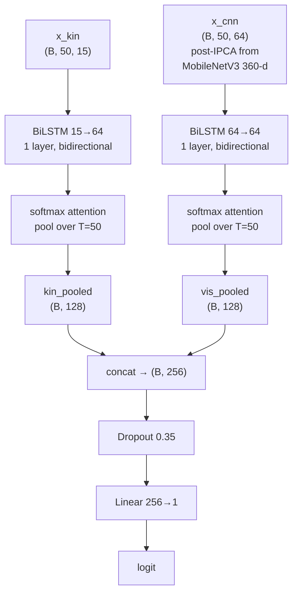
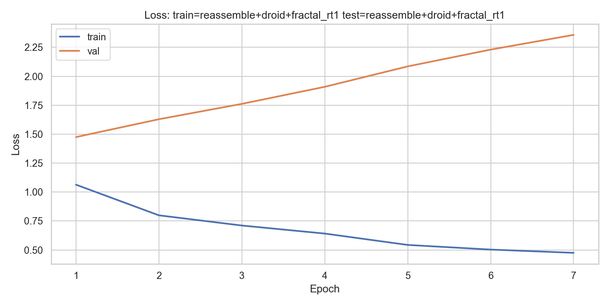
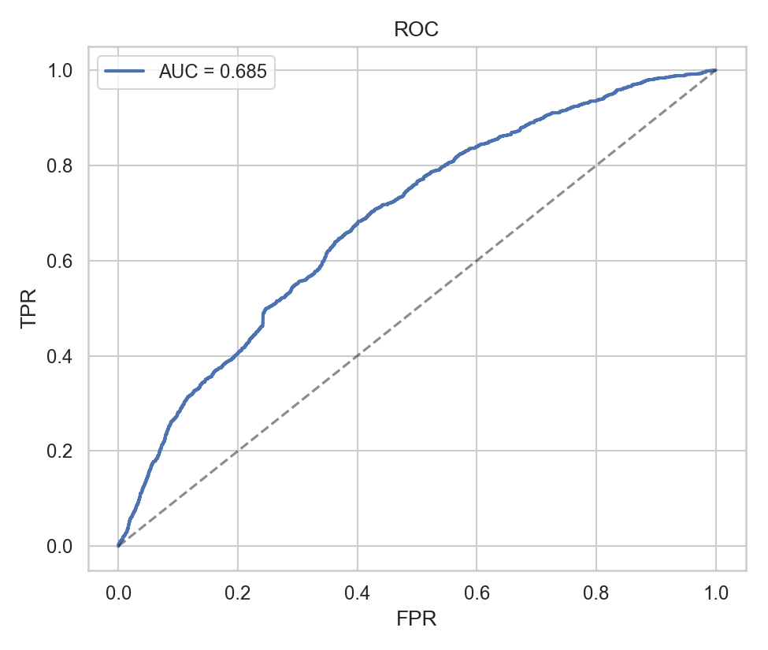
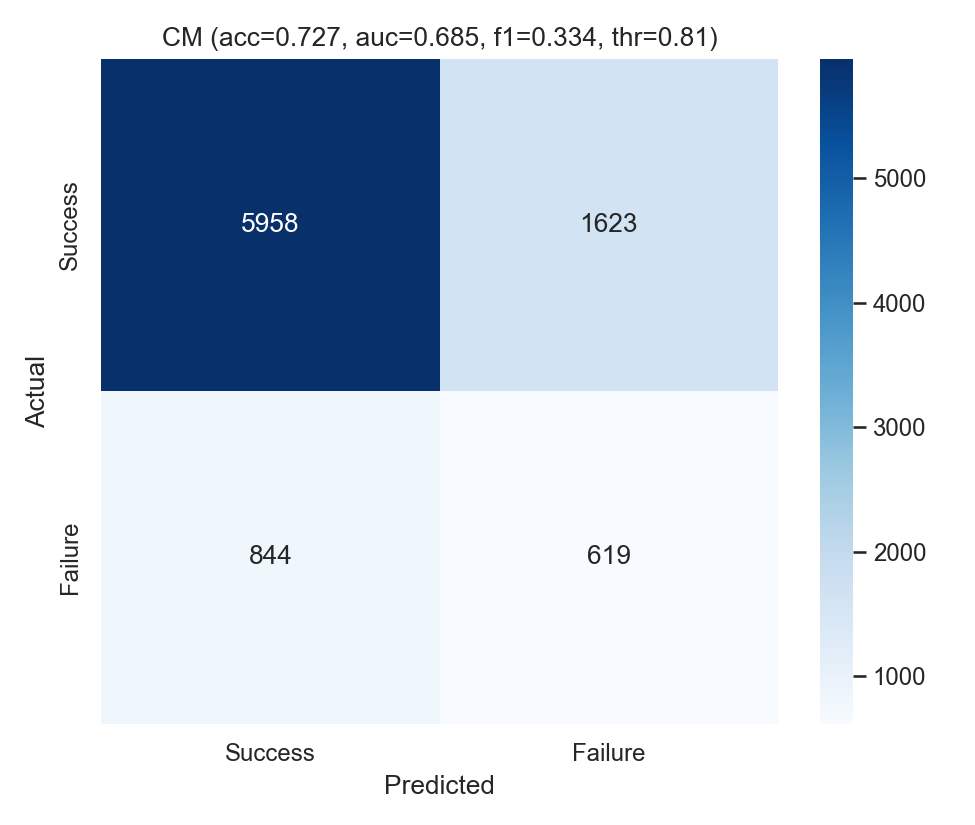
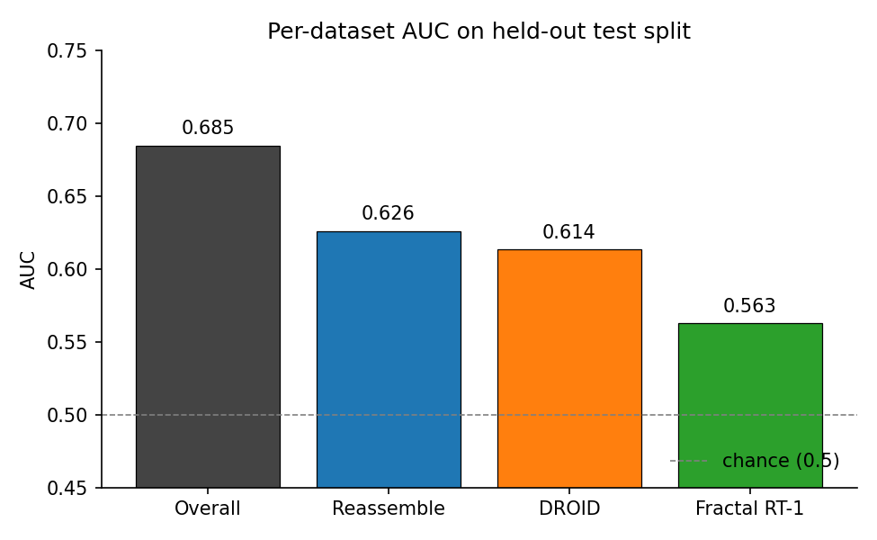
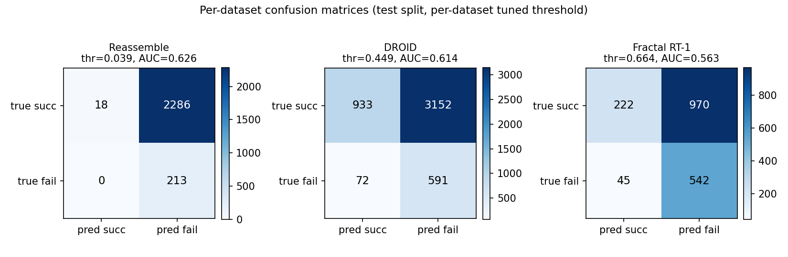

# A Cross Format Grasp Integrity Predictor built on Mosaico

How I trained a single `LateFusionLSTM` to emit per-frame failure probability across three heterogeneous robotic manipulation datasets (Reassemble, DROID, Fractal RT-1), with the data-plumbing layer collapsed onto a shared platform.

## Abstract

A binary grasp-failure classifier trained jointly on Reassemble (HDF5), DROID (h5 / ROS-bag layout) and Fractal RT-1 (TFRecord with the RLDS schema), all consumed through the same code path with no per-format branching thanks to [Mosaico](https://github.com/mosaico-labs/mosaico) as the data layer. The trained classifier reaches an overall AUC of 0.685 on a stratified held-out test split with calibrated probability output spanning the full [0.027, 0.999] range. Beyond the classifier numbers themselves, the application layer comes in at about 80 lines of dataset-specific code, against a rough estimate of 2000 lines for an equivalent pipeline built directly on `.h5` / `.tfrecord` / ROS-bag parsers. Everything below the projection step is Mosaico's work; the rest of this post is what I built on top of it.

## What Mosaico Is

In this project I used Mosaico to consume Reassemble (HDF5), DROID (h5 / ROS-bag) and Fractal RT-1 (TFRecord) through a single code path. Mosaico provides cross-format ingestion, multi-rate synchronization and ontology binding out of the box, so the application side did not need three format-specific parsers, three synchronization routines or three label adapters. Once the three datasets were ingested, training, evaluation and overlay rendering all ran on the same code regardless of where the data physically lived on disk.

[Mosaico](https://github.com/mosaico-labs/mosaico) itself is an open-source data platform for Physical AI: a Rust daemon (`mosaicod`) and a Python SDK (`mosaicolabs`) that together replace the linear ROS-bag and the ad-hoc dataset directory with a structured, queryable archive. The data model rests on three primitives:

- **Ontology**: a strictly-typed semantic model describing the shape of one signal. Core types ship in `mosaicolabs` (`Pose`, `Boolean`, `CompressedImage`, `Floating32`, `RobotJoint`, `ForceTorque`, `Velocity`); domain-specific ones (`EndEffector`, `SegmentInfo`, ...) live in plugin packs.
- **Topic**: a concrete time series of one ontology model, with a strict one-to-one binding between topic and ontology type.
- **Sequence**: a recording session, a logically related collection of topics sharing metadata.

Storage is decoupled from indexing. `mosaicod` handles ingestion, indexing, queries and lifecycle; a metadata database carries the structured part; blobs live in pluggable object storage (MinIO, S3 or local filesystem); Apache Arrow is the wire format between server and client, so the catalog is delivered to the Python side without serialization copies.

New sensors and file formats enter the platform through plugins. The manipulation pack [`mosaico-alchemy`](https://github.com/mosaico-labs/mosaico-alchemy) ships the ingestion plugins for the three datasets used here. From the application side, the SDK exposes the catalog as a single uniform DataFrame source: in this project I never read `.h5`, `.tfrecord` or ROS-bag files directly.

## The Data Plumbing Problem

Combining heterogeneous robotic datasets normally means writing one parser per format, one synchronization routine per sample rate, one ontology mapping per topic naming convention, and a maintenance burden that grows superlinearly with the fourth dataset. The cost is paid twice: in engineering time spent on bespoke data plumbing, and in slower experimentation on the actual model.

Mosaico is built around the idea that this overhead is the central friction in Physical-AI training, and dissolves it through the Physical-AI Bridge: a single uniform interface (`MosaicoClient` + `DataFrameExtractor` + `SyncTransformer`) that hides format-specific decoding behind shared ontology types and serves the same DataFrame contract regardless of the storage format underneath. The pipeline below uses that interface to assemble a non-trivial supervised learning task with bounded application code, and reports what the platform delivered at every step.

## Datasets

Three publicly available manipulation datasets sit in a single Mosaico catalog. Ingestion goes through the manipulation plugins in [`mosaico-alchemy`](https://github.com/mosaico-labs/mosaico-alchemy): each plugin declares the source layout, the ontology binding for every topic, and the payload iterator that turns raw bytes into typed messages.

| Dataset       | Source format | Sequences ingested | Frames at 50 Hz | Failure rate (sequence) |
|---------------|---------------|--------------------|-----------------|-------------------------|
| Reassemble    | HDF5          | 48                 | 700740          | 91.7 percent            |
| DROID         | h5 ROS bag    | 1483               | 1470074         | 16.4 percent            |
| Fractal RT-1  | TFRecord      | 874                | 620446          | 36.6 percent            |
| Total         |               | 2405               | 2791260         | mixed                   |

These three formats differ in non-trivial ways: nanosecond timestamps and quaternions as fixed-length arrays in Reassemble, ROS-bag-style topic naming in DROID, RLDS nested step structures in Fractal RT-1. Sample rates span 30 Hz to 100 Hz within a single sequence, image codecs are heterogeneous, and the gripper signal is recorded on three incompatible scales. After ingestion, the Mosaico-managed footprint on disk holds the original source corpus of roughly 90 GB as immutable, indexed blobs, with Postgres carrying the structured metadata; the precomputed CNN feature cache adds 356 MB of fp16 spatial features on top.

## The Pipeline, Step by Step

Every sequence in every dataset goes through the same chain. The application code path is identical across the three formats, with no `if dataset == ...` branch downstream of the SDK call site.

```python
from mosaicolabs import MosaicoClient
from mosaicolabs.ml import DataFrameExtractor, SyncHold, SyncTransformer
from mosaicolabs.models.platform import Sequence
from mosaicolabs.models.query import QuerySequence

client = MosaicoClient.connect(host="127.0.0.1", port=6726)
query = QuerySequence().with_expression(
    Sequence.Q.user_metadata["dataset_id"].eq(dataset_id)
)
for item in client.query(query):
    handler = client.sequence_handler(item.sequence.name)
    extractor = DataFrameExtractor(handler)
    sync = SyncTransformer(target_fps=50.0, policy=SyncHold())
    parts = []
    for sparse_chunk in extractor.to_pandas_chunks(topics=topics, window_sec=5.0):
        parts.append(sync.transform(sparse_chunk))
    dense = pd.concat(parts, ignore_index=True)
    dense = label_adapters.label(dataset_id, dense, handler)
    projected = feature_mapper.project(dataset_id, dense)
    projected = feature_mapper.add_derived_features(projected)
```

What this does, step by step:

1. **Server-side query** (`MosaicoClient.connect` + `QuerySequence().with_expression(...)`). The expression compiles into a server-side `WHERE` on the metadata column; the indexed catalog returns only the sequences that match. No client-side scan, no filesystem traversal, no per-dataset branching on storage layout.
2. **Sequence handle** (`client.sequence_handler(name)`). The catalog returns a typed handle into the indexed sequence, abstracting away the underlying storage location and surfacing the topics with their bound ontology types.
3. **DataFrame injection** (`DataFrameExtractor.to_pandas_chunks`). The SDK streams the requested topics directly into pandas DataFrames over Apache Arrow with bounded memory, regardless of how the source is laid out underneath. Three datasets, one DataFrame contract, zero serialization copies between server and client.
4. **Synchronization** (`SyncTransformer(target_fps=50.0, policy=SyncHold())`). Heterogeneous sample rates land on a single 50 Hz grid. The `SyncHold` forward-fill policy preserves quaternion unit norm (interpolation would silently corrupt orientation data) and is safe across booleans, floats, and array-typed payloads.
5. **Application projection** (`feature_mapper.project`). Mosaico delivers a uniform dot-notation schema (`<topic>.<ontology_tag>.<field>`) across the bound ontology types, and the application maps that schema onto the canonical 8-feature representation of the domain. This is where the application code lives; everything upstream is the platform.
6. **Derived features** (`add_derived_features`). Finite difference on the uniform timeline produced by `SyncTransformer`, yielding 7 velocity proxies that lift the kinematic vector to 15 dimensions.
7. **Label adapters** (`label_adapters.label`). Failure annotations are read through the same SDK handle, never from side-car files. The Reassemble label topic is read from either `/grasp_failure_label.boolean.data` (`Boolean` ontology) or `/grasp_failure_label.segment_info.success` (`SegmentInfo` ontology). I contributed the `SegmentInfo` ontology and a corresponding Reassemble plugin update upstream as part of this work (`mosaico-labs/mosaico-alchemy#4`).
8. **Same chain at evaluation time**. Inference at training time and inference at evaluation time use this exact chain, so the evaluation loop never diverges from the training pipeline.

## How Little Application Code Is Needed on Top

Thanks to Mosaico handling parsing, decoding, synchronization and ontology binding upstream, the only application code I had to write lives in `data/feature_mapper.py`: 8 base features, 7 derivatives, three projection functions (`project_reassemble`, `project_droid`, `project_fractal_rt1`) totalling roughly 80 lines. Mosaico canonicalizes transport and schema; cross-dataset semantics (what does "gripper open" mean across three control conventions) stays the application's responsibility, as it should. The single semantic decision at the application layer is the per-dataset gripper binarization, with thresholds 0.025 (Reassemble, meters), 0.5 (DROID, normalized), 0.5 (Fractal, quasi-binary), calibrated from histograms in `results/audit_cache.json`. After binarization `gripper_state` is a binary signal across the three datasets and `gripper_vel` becomes a clean edge detector for opening and closing.

For comparison, a from-scratch implementation would need a dedicated HDF5 parser for Reassemble (with `segments_info` traversal, two-finger gripper aggregation, per-topic JPEG decoding), an h5 ROS-bag-style parser for DROID (cartesian pose unwrapping, episode-level metadata, MP4 wrist-camera decoding at 30 fps), a TFRecord/RLDS parser for Fractal RT-1 (nested step structure traversal, terminal reward extraction, image byte unpacking), plus a custom multi-rate synchronization layer with quaternion-safe policies. A reasonable estimate is around 2000 lines of production parsing and synchronization code, before any modelling work begins. The pipeline here collapses that to about 80 application lines per dataset on top of `mosaicolabs`, a roughly 8× reduction in surface area, with the maintenance burden of upstream format changes absorbed by the SDK rather than the application.

## Network Architecture

The classifier is a small but carefully shaped network: 108 547 trainable parameters split across two parallel temporal encoders, one per modality, with a learned attention head that picks the informative frames out of every 50-frame window. The shape of the network was driven by three constraints that came out of the data analysis early on:

- **Two modalities at very different scales.** A 15-dim kinematic vector and a 64-dim visual descriptor (post-IPCA, originally 360 from MobileNetV3) cannot share a hidden state without one drowning the other. A late-fusion design keeps each modality's temporal representation independent up to the head.
- **Mixed supervision granularity across datasets.** Reassemble has per-frame labels; DROID and Fractal RT-1 carry only episode-level outcomes. A "last timestep" readout would discard most of the useful evidence for the latter two, so each stream uses a learned attention pool that picks where to look across the 50-frame window.
- **CPU-only training budget.** Training had to fit in roughly six minutes wall-clock on a Ryzen 7 with no GPU. The visual encoder (MobileNetV3 Small, ImageNet-pretrained) is therefore frozen and its forward pass cached to disk once per sequence; only the temporal head, the two attention layers and the fusion linear are trained.

### Topology

A late-fusion BiLSTM with attention pooling. Two streams encode kinematic and visual signal independently; their pooled outputs are concatenated and fed to a single linear head.



Total trainable parameters: **108 547**. Implementation in [`models/cached_lstm.py`](models/cached_lstm.py) (class `LateFusionLSTM`).

### Design Choices

- **Late fusion, not early fusion.** Kinematic (15 dim) and visual (64 dim) streams differ by ~4× in width and live on different scales. An early-fusion BiLSTM would let the dominant visual stream drown the kinematic signal in the joint hidden state. Splitting the encoders keeps each modality's temporal representation independent up to the head. An early-fusion variant (`CachedFeatureLSTM`) is also implemented in `models/cached_lstm.py`.
- **Learned attention pool over time, not last-timestep readout.** DROID and Fractal RT-1 carry episode-level labels (one bit per ~10 s sequence, not one bit per frame). Any frame in a 50-frame window is informative, so a fixed "use the last timestep" readout discards useful evidence. Each stream gets a learned softmax attention vector over T = 50, applied independently to kin and vis. The `attn_pool` flag in `LateFusionLSTM` toggles between learned-attention and last-timestep readout; the released run uses the learned attention.
- **IPCA reduces visual to 64 dims.** Raw MobileNetV3 features are 360-dim; reducing to 64 brings them in line with the kin BiLSTM hidden width. IPCA is fit on the training split only and applied unchanged downstream.
- **MobileNetV3 layer 6 + `AdaptiveMaxPool2d(3)`.** Tapping layer 6 (not the final classifier head) and pooling to a 3×3 spatial grid preserves geometric structure (where in the frame the gripper / object is) instead of collapsing to a single semantic vector.
- **Frozen visual encoder + precomputed cache.** CPU training is feasible only if the CNN forward pass happens once and is reused across N runs. The cache is 356 MB of fp16 spatial features (already git-ignored).
- **15-feature canonical kinematic schema.** 8 base features (3 end-effector position + 4 quaternion + 1 gripper scalar) + 7 finite-difference derivatives. The 8-base set is the largest common denominator across the three datasets; the 7 derivatives are the only per-frame time-varying signal for episode-labeled datasets.
- **Per-dataset gripper binarization.** Reassemble records gripper in meters, DROID normalized, Fractal binary. Without canonicalization the z-scored value identifies the dataset rather than the state. Thresholds (`Reassemble 0.025`, `DROID 0.5`, `Fractal 0.5`) calibrated from histograms.

### Training Setup

| Hyperparameter | Value | Note |
|---|---|---|
| Sequence length | 50 frames (1 s @ 50 Hz) | sliding window, stride 50 (no overlap) |
| Batch size | 64 | |
| Epochs | 30 | |
| Optimizer | Adam, `lr=1e-3`, `weight_decay=1e-3` | |
| Scheduler | `ReduceLROnPlateau` | |
| Loss | `BCEWithLogitsLoss`, `pos_weight=4.522` | auto-computed from class imbalance |
| Dropout | 0.35 (fusion head) | LSTM encoders with `num_layers=1` have no internal dropout by PyTorch convention |
| Kin noise | `std=0.02` | Gaussian, training only |
| Sampler | `WeightedRandomSampler` | oversamples minority class |
| Gradient clip | 1.0 | |
| SWA | from epoch 8 | |
| Seed | 42 | |
| Wall time | ~6 min on Ryzen 7 CPU | no GPU |

Full configuration in [`results/multimodal_indist_v9_sharp/results.json`](results/multimodal_indist_v9_sharp/results.json).

<p align="center">
  <br/>
  <em>Training and validation loss across the 30 epochs. Validation loss plateaus shortly after the SWA window opens at epoch 8.</em>
</p>

### Results

Test set, stratified per-dataset 70 / 15 / 15 split (seed 42), threshold tuned on the validation split.

| Metric | Value |
|---|---|
| Overall AUC (test) | **0.685** |
| Overall F1 (test, threshold 0.806) | **0.334** |
| Class separation (P_fail − P_succ) | 0.173 |
| Reassemble AUC | 0.626 |
| DROID AUC | 0.614 |
| Fractal RT-1 AUC | 0.563 |
| P(failure) range observed | [0.027, 0.999] |
| Confident failure (P > 0.8) window fraction | 25.1 % |
| Confident success (P < 0.2) window fraction | 13.8 % |

<p align="center">
  <br/>
  <em>ROC curve on the overall held-out test set. AUC = 0.685, comfortably above the 0.5 chance line.</em>
</p>

<p align="center">
  <br/>
  <em>Confusion matrix at the F1-optimal threshold (0.806). Recall on the failure class is intentionally favored over precision, which suits a safety-monitoring use case.</em>
</p>

## Cross Format Generalization

A single set of weights, trained jointly on data canonicalized from HDF5, h5 ROS-bag and TFRecord, generalizes above chance to each of the three storage formats without dataset-specific code paths anywhere in the model or the loader. Reassemble (frame-level supervision) leads the per-dataset numbers; DROID and Fractal RT-1 (episode-level supervision) trail it but stay clearly above the 0.5 chance line.

<p align="center">
  <br/>
  <em>AUC broken down by source format. All three sit above 0.5 chance; Reassemble leads because it is the only dataset with frame-level labels.</em>
</p>

The structural ceiling on DROID and Fractal is set by their supervision granularity, not by the cross-format pipeline: any window inside an episode inherits the episode-level label, so the model cannot learn to localize the failure moment within the sequence. This is a property of the data, not of the model. Calibration is consistent across formats: the classifier emits probabilities across the full unit interval, so the threshold 0.806 selects a calibrated decision rather than chasing the small differences typical of an under-separated classifier.

<p align="center">
  <br/>
  <em>Per-dataset confusion matrices at the F1-optimal threshold for each format (Reassemble 0.039 is aggressive because its prior is 91.7 % failure; DROID 0.449 and Fractal 0.664 sit in the more conventional range).</em>
</p>

## Closing the Loop on the Recorded Trajectories

Beyond the test-set metrics, the classifier runs at 50 Hz over the cached kinematic and CNN tensors of held-out test sequences, and its per-frame `P(failure)` is overlaid on top of the original source video frames produced by Mosaico (Reassemble `/hand` blob at 30 fps, DROID exterior camera at 15 fps). Inference runs against the windows the SDK produced at training time, and the rendered frames are the actual recordings the classifier scored: what the viewer sees is what the model saw. All sequences used for these overlays come from the 15 % held-out test split persisted at `results/test_split.json` (stratified per dataset, seed 42, never seen during training or validation tuning).

## Practical Takeaways

Three observations from this project, mapped onto how Mosaico actually paid off:

**Efficiency.** The application code on top of the SDK is three canonical projection functions and a per-dataset gripper threshold table, around 80 lines per dataset. The training script, the dataset wrapper, and the renderer are dataset-agnostic by construction. Adding a fourth dataset requires one new projection function and one threshold; everything else compiles unchanged. Mosaico absorbs the parsing, decoding, and synchronization burden upstream.

**Integrity.** `SyncTransformer` is what makes a cross-modality BiLSTM possible at all. Joint torque at 100 Hz, vision at 30 Hz, and sparse event topics land at the model on a single 50 Hz grid with consistent timestamps; `SyncHold` preserves quaternion unit norm where naive interpolation would not. None of this logic appears in application code.

**Reusable inference.** The same `predict_proba` call that produced the test-set metrics fires against held-out test windows during overlay rendering, in the same DataFrame layout that Mosaico produced at training time. Training-time and evaluation-time inference share one interface and one data contract.

The honest limit of the result is bounded by supervision granularity, not by the bridge: Reassemble is the only dataset with per-frame failure labels, DROID and Fractal carry episode-level outcome flags only. With 48 Reassemble sequences contributing the only frame-level supervision, an overall AUC of 0.685 is consistent with that structural ceiling. A more accurate classifier would require additional per-frame annotations, which is orthogonal to what Mosaico does. The pipeline itself delivers what the Physical-AI Bridge promises: one interface, three storage formats, one classifier that generalizes across all of them.

## Reproducibility

Reproducing the project from raw data takes roughly three hours of wall-clock total. The end-to-end procedure is documented in [`README.md`](README.md): clone the repository, bring up the Postgres + MinIO + `mosaicod` stack with `docker compose -f docker/compose-training.yml up -d`, ingest the three datasets via the SDK plugins, precompute the CNN cache once with `scripts/precompute_cnn_features.py` (about 3 hours, idempotent), train with `scripts/run_v9.sh released` (about 6 minutes), and render the per-act overlays with `scripts/video_overlay_demo.py`. All hyperparameters, the random seed (42), and the per-dataset metrics are persisted to `results/multimodal_indist_v9_sharp/results.json`.

## References and Acknowledgments

- Source repository (this case study): [github.com/EdoardoBambini/grasp-predictor](https://github.com/EdoardoBambini/grasp-predictor).
- Mosaico, the data platform for Physical AI: [mosaico.dev](https://mosaico.dev), [github.com/mosaico-labs/mosaico](https://github.com/mosaico-labs/mosaico). Python SDK package `mosaicolabs`.
- Manipulation pack and ingestion plugins: [github.com/mosaico-labs/mosaico-alchemy](https://github.com/mosaico-labs/mosaico-alchemy).
- Reassemble dataset (HDF5 manipulation recordings).
- DROID dataset (large scale teleoperated manipulation, h5 / ROS bag layout).
- Fractal RT-1 dataset (RT-1 robotics transformer rollouts, RLDS / TFRecord format).
- MobileNetV3 Small ImageNet weights from `torchvision`.
