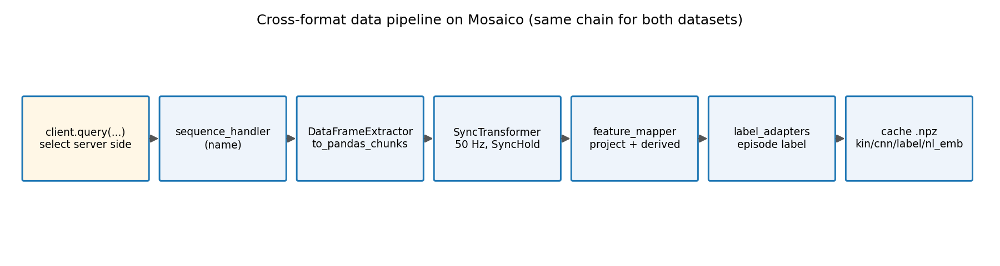
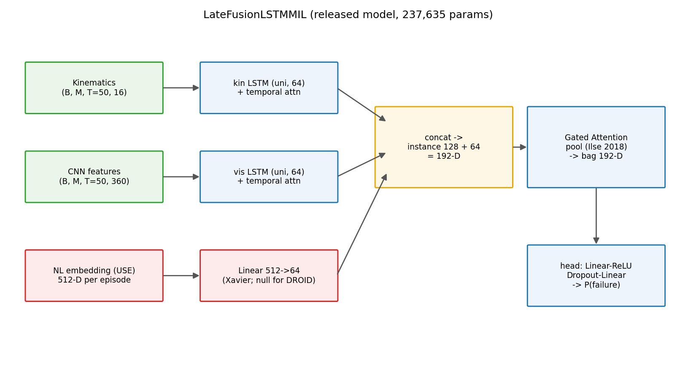
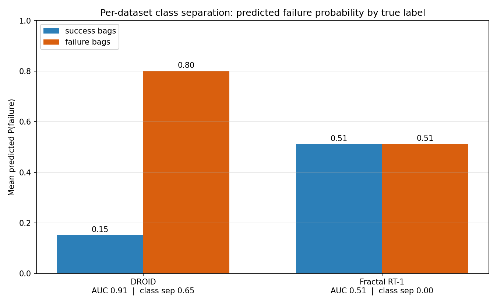
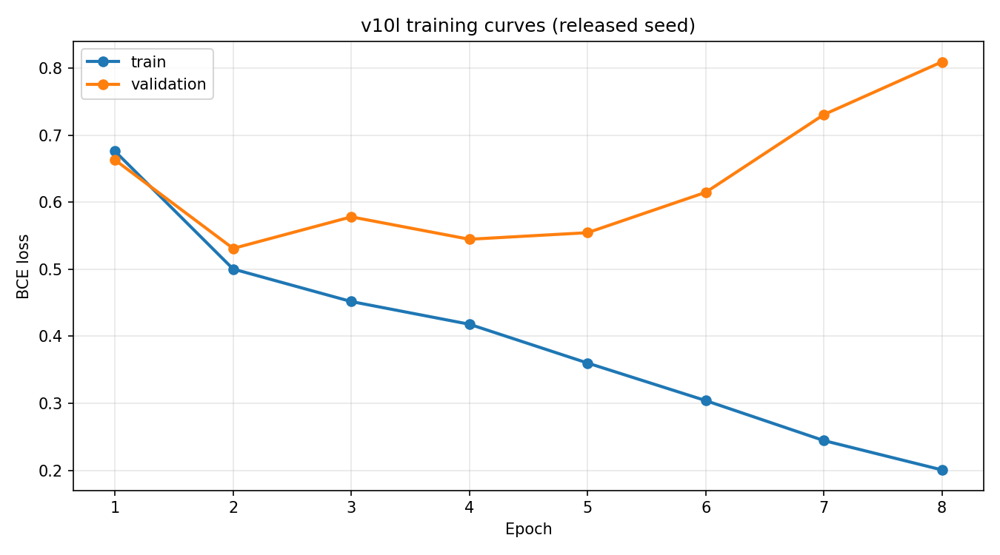

# Technical writeup: a cross-format grasp failure classifier on Mosaico

I came across Mosaico while looking for a clean way to train one model on several
robotics datasets that are stored in incompatible formats. I read through how the
platform works and reached out to the people building it; they told me they were about
to release the ingestion side as a separate project,
[mosaico-alchemy](https://github.com/mosaico-labs/mosaico-alchemy). To get a real feel
for the platform I decided to build something deliberately simple: a single binary
grasp-failure classifier trained on more than one dataset at once. This writeup is what
I built and, more to the point, how I used Mosaico to do it.

The goal was never to win a benchmark. It was to learn how Mosaico behaves when you
train one model on two datasets stored in completely different formats, and to see what
a uniform cross-format data layer surfaces that you would miss looking at each dataset
on its own. DROID is stored as parquet in the RLDS layout and Fractal RT-1 as TFRecord;
once both are in the catalog, the application code never touches either format again.

## Mosaico in brief

Mosaico is a data platform for physical AI. You ingest recordings once, and from then
on the application code talks to a uniform catalog over Apache Arrow instead of reading
parquet, TFRecord or ROS bag files by hand. Two pieces carry this project:

1. A query layer that selects sequences server side by metadata or by ontology field
   values, the same way regardless of the underlying format.
2. A streaming extraction layer (`DataFrameExtractor` plus `SyncTransformer`) that turns
   a sequence into a dense, uniformly sampled pandas DataFrame.

Installing the Python SDK is one line:

```bash
pip install mosaicolabs
```

## Getting the data in with mosaico-alchemy

Ingestion plugins for the public datasets live in
[mosaico-alchemy](https://github.com/mosaico-labs/mosaico-alchemy). The manipulation
pack currently ships plugins for reassemble, droid, fractal_rt1 and mml. The flow is
short: clone the repo, download the datasets you want from their original sources, then
run the CLI to ingest them into your local Mosaico instance:

```bash
mosaico_alchemy manipulation --datasets /path/to/droid /path/to/fractal20220817_data \
  --host localhost --port 6726 --write-mode sync
```

Everything below assumes the datasets are already in the catalog.

## Curating the training set with the query layer

This is the part I leaned on the most. Before training I used the query layer to
understand the catalog (counts per dataset, the natural failure prior, and which topic
or metadata field carried the label), and then to pull a labelled pool of success and
failure sequences per dataset. The selection lives in
[`scripts/build_balanced_pools_via_mosaico.py`](scripts/build_balanced_pools_via_mosaico.py)
and writes `results/pools_via_mosaico.json`. Every dataset goes through the same
`MosaicoClient.query(...)` entry point; only the predicate differs per format.

**DROID** carries an episode level boolean in its sequence metadata, so the success and
failure pools are a pure server side query on `is_episode_successful`:

```python
from mosaicolabs.models.query import QuerySequence

q_succ = (
    QuerySequence()
    .with_user_metadata("dataset_id", eq="droid")
    .with_user_metadata("is_episode_successful", eq=True)
)
q_fail = (
    QuerySequence()
    .with_user_metadata("dataset_id", eq="droid")
    .with_user_metadata("is_episode_successful", eq=False)
)
succ = sorted({it.sequence.name for it in client.query(q_succ)})
fail = sorted({it.sequence.name for it in client.query(q_fail)})
```

On the catalog this returns 5306 success and 1100 failure sequences, a natural failure
prior near 17 percent. After the CNN precompute, 4340 of them carry a cached descriptor
and feed the split.

**Reassemble** (which I tried early on and dropped from the released model) exposes its
label as a Boolean ontology value on a dedicated topic, so the same idea runs at the
ontology level. This is the cleanest illustration of the query layer, because the
predicate runs on the field value itself, combined server side with a topic filter and a
dataset filter in a single call:

```python
from mosaicolabs import Boolean
from mosaicolabs.models.query import (
    QueryOntologyCatalog, QuerySequence, QueryTopic,
)

# Failure: /grasp_failure_label.boolean.data == True
fail = sorted({
    it.sequence.name
    for it in client.query(
        QuerySequence().with_user_metadata("dataset_id", eq="reassemble"),
        QueryTopic().with_name("/grasp_failure_label"),
        QueryOntologyCatalog().with_expression(Boolean.Q.data.eq(True)),
    )
})
```

The topic name filter matters: without it the Boolean predicate would match every
boolean field in every topic of the catalog.

**Fractal RT-1** does not expose a ready made success flag. Its success signal is the
reward at the terminal step of the episode, which the ontology query cannot express
(it matches point values, not the last sample of a topic). So I run a hybrid: a server
side name query, then read the per episode label from the precompute cache, where it
was derived from the Mosaico ingested reward stream by
[`data/label_adapters.py`](data/label_adapters.py). It is one extra step than DROID, but
the label still comes from Mosaico ingested data:

```python
import numpy as np
from mosaicolabs.models.query import QuerySequence

q_all = QuerySequence().with_user_metadata("dataset_id", eq="fractal_rt1")
all_names = sorted({it.sequence.name for it in client.query(q_all)})

# Label per sequence = terminal /step/reward > 0, read from the precompute cache
# (the same Mosaico ingestion pipeline that produced the features).
for name in all_names:
    p = cache_by_name.get(name)
    if p is None:
        continue
    with np.load(p) as z:
        label = int(np.asarray(z["label"]).max() > 0.5)
    if label == 1:
        fail.append(name)
    else:
        succ.append(name)
```

Fractal returns 3972 sequences in the catalog; 3093 carry a cached descriptor (1950
success, 1143 failure), a natural failure prior near 37 percent, spread across 471
distinct language instructions.

A note on the 65/35 balance, because it is easy to overstate. The queries return the
pools at their natural prior, not balanced. The 65 percent success and 35 percent
failure ratio is applied afterwards, when assembling the training set, by
`split_by_pools_proportional` in
[`run_training_cached.py`](run_training_cached.py). It builds a 70/15/15 split per
dataset, balances only the training partition to the chosen success ratio, and leaves
validation and test at the natural prior so the reported metrics reflect production
conditions. Mosaico does the cross-format selection and labelling; the prior is a
sampling choice on top of the pools it returns.

## Building the batches

For each selected sequence the pipeline runs the same Mosaico chain, in
[`data/cross_dataset_ingestor.py`](data/cross_dataset_ingestor.py):



```python
h = self._client.sequence_handler(seq_name)

ex = DataFrameExtractor(h)
sync = SyncTransformer(target_fps=self._fps, policy=SyncHold())  # self._fps = 50.0

dense_parts = []
for sparse in ex.to_pandas_chunks(topics=topics, window_sec=self._window_sec):
    if sparse is None or sparse.empty:
        continue
    dense_chunk = sync.transform(sparse)   # state carried across chunk boundaries
    if dense_chunk is None or dense_chunk.empty:
        continue
    dense_parts.append(dense_chunk)
dense = pd.concat(dense_parts, ignore_index=True)

# Label BEFORE projection: /step/reward, /step/is_terminal and /grasp_failure_label
# need to be still in the dense df.
dense = label_adapters.label(dsid, dense, h)

projected = feature_mapper.project(dsid, dense)        # canonical 15-feature schema
projected = feature_mapper.add_derived_features(projected)  # finite-difference velocities
```

The steps are:

1. `client.sequence_handler(name)` gives a handle to the sequence.
2. `DataFrameExtractor(h).to_pandas_chunks(topics, window_sec)` streams the requested
   topics as sparse, per topic DataFrames, one window at a time, so memory stays bounded.
3. `SyncTransformer(target_fps=50.0, policy=SyncHold())` resamples every chunk onto a
   uniform 50 Hz grid. `SyncHold` is a forward fill policy: it carries the last valid
   sample forward until a new one arrives. This is what lets DROID (already high rate)
   and Fractal RT-1 (3 Hz native, an upsample of roughly 16x) line up on the same time
   axis, and it is safe on booleans, floats and quaternions, where linear interpolation
   would either be meaningless or break the unit norm. The transformer keeps state
   across chunk boundaries, so streaming a long sequence in windows gives the same
   result as processing it whole.
4. [`data/label_adapters.py`](data/label_adapters.py) attaches the episode label before
   projection, while the reward and terminal topics are still present in the dense df.
5. [`data/feature_mapper.py`](data/feature_mapper.py) projects the dataset specific
   columns onto a canonical 15 feature kinematic schema (3 end effector position, 4 end
   effector quaternion, 1 binarized gripper, plus 7 finite difference velocities) and
   binarizes the gripper per dataset so the raw scale does not leak the dataset identity
   through the bridge.

The visual stream is precomputed once by
[`scripts/precompute_cnn_features.py`](scripts/precompute_cnn_features.py). For every
sequence, every frame is resized to 112x112 and pushed through a frozen ImageNet
MobileNetV3 Small, tapping layer 6 followed by `AdaptiveMaxPool2d(3)`, which yields a
360 dimensional spatial descriptor per frame stored at fp16. Freezing and caching the
encoder is what makes training on CPU realistic: the expensive forward pass happens once
and is reused across every training run.

The application code that sits on top of Mosaico is small, on the order of a few dozen
lines per dataset, and it is the same code for both formats. That is the first concrete
thing the platform bought me.

## The model

The released model is `LateFusionLSTMMIL` in
[`models/mil_attention.py`](models/mil_attention.py), with 237635 trainable parameters.



It is built as Multiple Instance Learning. DROID and Fractal carry one label per
episode, replicated onto every frame at precompute time. A plain window classifier
trained on that signal is told that the calm approach windows of a failing episode are
themselves failures, which produces contradictory gradients and a model that plateaus
near chance. MIL is the elegant fit: a bag is one sequence, an instance is one 50 frame
window, the bag label is known, and a gated attention pool learns which windows carry
the signal and emits a per-window weight along the way.

The tensor flow per bag is:

```
X_kin : (B, M, T=50, 16)        16-D kinematics per frame
X_cnn : (B, M, T=50, 360)       360-D cached CNN descriptor per frame
nl_emb: (B, 512)                USE instruction embedding (Fractal); DROID -> null token

WindowEncoder (per window, attn_pool on, uni LSTM):
  LSTM_kin  16  -> 64, temporal softmax attention pool -> 64
  LSTM_vis  360 -> 64, temporal softmax attention pool -> 64
  concat                                              -> 128-D instance embedding

NL concat (pre-pool):
  nl_proj   Linear(512, 64) Xavier, broadcast over M  -> instance 128 + 64 = 192-D

GatedAttentionPool (Ilse et al., 2018):
  192-D instances -> softmax gated attention over valid windows -> 192-D bag embedding

Head:
  Linear(192, 128) -> ReLU -> Dropout(0.35) -> Linear(128, 1) -> logit
```

The window encoder reuses the late-fusion recipe: a unidirectional LSTM over the
kinematics and another over the CNN features, each with a temporal attention pool, then
concatenated.

```python
def forward(self, x_kin, x_cnn):
    kin_out, _ = self._lstm_kin(x_kin)
    vis_out, _ = self._lstm_vis(x_cnn)
    a_kin = torch.softmax(self._attn_kin(kin_out), dim=1)
    kin_pooled = (a_kin * kin_out).sum(dim=1)
    a_vis = torch.softmax(self._attn_vis(vis_out), dim=1)
    vis_pooled = (a_vis * vis_out).sum(dim=1)
    return torch.cat([kin_pooled, vis_pooled], dim=-1)
```

The language instruction is encoded with a Universal Sentence Encoder (512 dimensions),
projected to 64 with a Xavier initialised linear layer, and concatenated to every
instance before the bag pool. DROID has no instruction, so it routes through a learnable
null token selected per bag by an `is_droid` mask. Routing language pre-pool through a
Xavier linear (rather than an identity initialised FiLM block) keeps gradient flowing
from step 0:

```python
if nl_emb is None:
    nl_in = self.nl_null.expand(B, -1)
elif is_droid is not None:
    null_expanded = self.nl_null.expand(B, -1)
    nl_in = torch.where(is_droid.view(B, 1), null_expanded, nl_emb)
else:
    nl_in = nl_emb
nl_p = self.nl_proj(nl_in)                    # (B, nl_concat_dim)
nl_p = nl_p.unsqueeze(1).expand(B, M, -1)     # (B, M, nl_concat_dim)
win_emb = torch.cat([win_emb, nl_p], dim=-1)
```

The bag pool is the Gated Attention pool of Ilse et al. (2018). It scores each instance
with a gated nonlinearity, softmax normalizes over the valid windows of the bag, and
sums:

```python
v = torch.tanh(self._V(H))
u = torch.sigmoid(self._U(H))
logits = self._w(v * u).squeeze(-1)           # (B, M)
if mask is not None:
    logits = logits.masked_fill(~mask, float("-inf"))
attn = torch.softmax(logits, dim=1)
bag = (attn.unsqueeze(-1) * H).sum(dim=1)
```

The 16th kinematic feature deserves a note. The 15 canonical features are shared by both
datasets. Fractal RT-1 also records a commanded gripper signal, so a 16th channel
carries the difference between commanded and sensed gripper closedness. DROID has only
the sensed value, so its 16th channel is zero padded at load time.

Training uses symmetric (plain) binary cross entropy with `pos_weight` 1.0, Adam at 1e-3
with weight decay 1e-3, `ReduceLROnPlateau` (factor 0.5, patience 2), stochastic weight
averaging from epoch 8, and PCGrad gradient surgery, which splits the loss per dataset
and projects conflicting gradients so one dataset does not cancel the other. Batches are
16 bags, dropout 0.35.

## Iteration history

The released model is the result of a sequence of changes. The table below lists the per
dataset test AUC at each step. Versions v10f through v10i are three seed means; v10l is a
three seed mean as well, and the released checkpoint is seed 7. v9 is an earlier single
seed baseline that trained on three datasets at the natural prior.

| Version | Key change | DROID AUC | Fractal AUC |
|---------|------------|-----------|-------------|
| v9 | three datasets, natural prior, window level | 0.614 | 0.563 |
| v10f | MIL with Gated Attention pooling | 0.667 | 0.550 |
| v10g | symmetric loss, masked pooling | 0.704 | 0.514 |
| v10h | window filtering, uni LSTM, no PCA, plain BCE | 0.945 | 0.511 |
| v10i | gripper command minus sensed residual | 0.970 | 0.471 |
| v10k | language conditioning via FiLM | 0.960 | 0.498 |
| v10l | PCGrad plus language embedding concat pre pool | 0.942 | 0.495 |

The v9 number reported elsewhere (overall AUC 0.685, class separation 0.173) was
inflated by a dataset identity confound: Reassemble's failure rate in that run was above
90 percent, so the network could partly shortcut "this looks like Reassemble" to
"failure". Removing Reassemble and balancing the prior removed that shortcut, which is
why the early v10 overall numbers look lower before the architectural cleanup brought
DROID up sharply.

The four changes in v10h are the ones that moved DROID from the high 0.60s to 0.945.
First, window filtering: a DROID failure is impulsive and concentrated in the last
second or two, so most windows of a failure bag look like success windows and the gated
attention pool over-smooths toward a mean. Restricting each DROID failure bag to its
last 30 percent of windows before the pool, while computing the bag label before
filtering, fixes this. Second, a unidirectional LSTM: a bidirectional encoder lets the
representation at an early frame depend on the conclusion of the sequence, which for a
causal failure task is a form of leakage and also flattens the embeddings the pool sees.
Third, dropping the PCA reduction of the visual features: the failure cues live in low
variance, high frequency components that a variance preserving PCA discards, so the LSTM
gets the full 360 dimensional descriptor. Fourth, plain symmetric binary cross entropy
instead of an asymmetric loss whose margin created a dead zone and pinned predictions in
a narrow band.

v10i added the gripper command residual described above. v10k tried to condition on
language through FiLM, and v10l replaced that with concatenating the sentence embedding
into every instance before the pool and adding PCGrad. On DROID these refinements pushed
AUC to 0.91 on the released seed (0.94 averaged over three seeds).

## Results

From `results/multimodal_indist_v10l_seed7/results.json` (the released seed), with
validation and test at each dataset's natural prior:



On DROID the model is production grade. Test AUC 0.91, class separation 0.65 (mean
predicted failure probability 0.80 on failure sequences and 0.15 on success sequences),
accuracy 0.91. Across three seeds DROID averages AUC 0.94 +/- 0.03 and class separation
0.71 +/- 0.04: strong and stable.

On Fractal RT-1 the same weights, in the same forward pass, return AUC 0.51 with class
separation essentially zero (mean predicted failure probability 0.51 on both success and
failure sequences), accuracy 0.39. Across three seeds Fractal class separation is
0.00 +/- 0.00 and AUC 0.50 +/- 0.01: chance. The class separation figure above shows the
contrast directly, two well separated bars on DROID and two nearly identical bars on
Fractal.



The training curves show the validation loss starting to rise after a few epochs, which
is why best model selection and SWA matter; the released checkpoint is the best
validation epoch.

## The finding: why Fractal stays at chance

Fractal's AUC stayed inside a narrow band around 0.5 across every architectural change I
made, from MIL pooling to window filtering to the language embedding. That invariance is
not an optimization failure. It is a property of the labels.

Fractal RT-1 pools hundreds of distinct tasks under one dataset id, with 471 different
language instructions in the slice I used. The label is the reward at the terminal step,
which measures task success, not grasp success. The same physical motion carries
opposite labels depending on the instruction that opened the episode: a gripper
releasing an object onto a table is a success for "place the can on the table" and a
failure for "put the can in the drawer". A classifier that sees the kinematic and visual
streams is asked to map nearly identical inputs to opposite targets, so the gradient
collapses to the prior and the logits flatten.

v10l does feed in the instruction, as a Universal Sentence Encoder embedding
concatenated to every instance. It moved Fractal only marginally, from chance to about
0.54 AUC. The honest reading is that simply having the instruction present is not enough
at this scale. Methods that succeed at multi-task failure detection extract features from
a vision language action model whose latent space already fuses observation and
instruction; a model with a few hundred thousand parameters that concatenates a sentence
vector to a small LSTM cannot reconstruct that fusion. The bottleneck on Fractal is the
supervision semantics, not the data plumbing.

This is a clean negative result because of how it was produced. Every intervention that
helped DROID was applied to Fractal in the same training run, the same forward pass and
the same loss, and none of them moved Fractal out of the chance band. The cross-format
pipeline treats both datasets identically; what differs is the meaning of their labels.

## What the cross-format layer made possible

The reason this is worth writing down is that the asymmetry is invisible if you study
either dataset alone. Training a model on DROID alone, you would conclude the approach
works. Training on Fractal alone, you might blame your architecture or your tuning.
Putting both through one pipeline, with identical architecture and loss, makes the
dataset the only variable, and the result localizes the problem precisely: not the data
plumbing, not the network, but the meaning of one dataset's supervision. Surfacing that
kind of cross-dataset insight is exactly what a uniform data layer is for. Mosaico did
not solve the Fractal problem; it put me in a position to find it.

## Demo: online failure monitoring

The DROID model is strong enough to watch in real time, and that is what the demo does.
[`scripts/video_overlay_demo.py`](scripts/video_overlay_demo.py) replays DROID episodes
held out from training, validation and test, and draws the model's per-window failure
probability on top of the exterior camera as the episode unfolds. The probability is a
running readout over the windows observed so far, so the overlay reads like a live grasp
integrity monitor: it stays low through a clean approach and rises as the model picks up
the signature of a failing grasp.
[`scripts/concat_acts.py`](scripts/concat_acts.py) stitches the selected clips into one
short timeline. The shipped `results/video_overlay_demo/acts_v10l_droid_test.json`
picks four held-out episodes, two that fail and two that succeed, and the same model and
weights from the released checkpoint drive every frame. With the source DROID videos on
disk it regenerates with:

```bash
python scripts/video_overlay_demo.py --droid-parquet-root /path/to/droid/data
python scripts/concat_acts.py
```

It is a compact way to show the gated attention pool doing its job: the windows it weighs
most heavily are the ones where the grasp actually goes wrong.

## Limitations and rough edges

The one real friction in selection was Fractal RT-1, and it is more a property of the
dataset than of Mosaico. DROID and Reassemble each expose a success signal the catalog
can filter on directly, an episode boolean in DROID's metadata and a Boolean ontology
value on a Reassemble topic, so their pools are a pure server side query. Fractal carries
no episode level success field at all: its only success signal is the reward at the
terminal step, a per step time series. So for Fractal I query the sequence names server
side and read the per episode label from the cache, where it was derived from the
ingested reward stream. Any pipeline would have to derive that flag somewhere, since the
dataset simply does not ship one; computing it from the terminal reward at ingest and
writing it into the sequence metadata would make Fractal filterable exactly like the
other two. It is worth being precise that such a flag would mean task success conditioned
on the instruction, a different kind of label from DROID's mechanical grasp outcome, so
it would help curation without changing the learnability discussed in the finding.

## What I liked and what could be smoother

What worked well, restated plainly: one query entry point across parquet and TFRecord,
server side selection by metadata and by ontology value, a streaming extractor that
reduced multi rate alignment to a single policy choice, and an application layer that
stayed small and format agnostic. For a project whose whole point was to try the
platform, those are the parts that did the work.

The one addition I would genuinely want is a place to keep the trained model. Mosaico
versions and serves the data and the curation that produced this checkpoint, but the
model itself ends up outside the catalog: there is no way to register the released
checkpoint as an artifact next to the dataset slice and the queries it came from. Storing
the trained model as a first class artifact in Mosaico, linked to the data it was trained
on, would close the loop from raw recordings to curated training set to model in a single
catalog.

## Reproducing

The end to end procedure is in the [README](README.md): ingest DROID and Fractal RT-1
through mosaico-alchemy, build the pools with
`scripts/build_balanced_pools_via_mosaico.py`, precompute the CNN cache with
`scripts/precompute_cnn_features.py`, train with `scripts/train.sh`, and regenerate the
figures with `scripts/make_figures.py`. Hyperparameters, the seeds and the per dataset
metrics are persisted under `results/multimodal_indist_v10l_seed7/results.json` (released
seed; seeds 42 and 123 are alongside it for the three seed aggregate).

## References

- Mosaico, data platform for physical AI: [github.com/mosaico-labs/mosaico](https://github.com/mosaico-labs/mosaico). Python SDK package `mosaicolabs`.
- Manipulation ingestion plugins: [github.com/mosaico-labs/mosaico-alchemy](https://github.com/mosaico-labs/mosaico-alchemy).
- DROID dataset, large scale teleoperated manipulation.
- Fractal RT-1 dataset, RT-1 rollouts in RLDS / TFRecord format.
- Ilse, Tomczak, Welling, Attention-based Deep Multiple Instance Learning, ICML 2018.
- MobileNetV3 Small ImageNet weights from torchvision.
